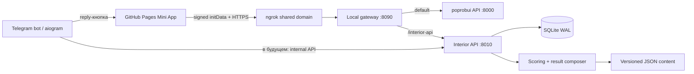

# Архитектура Interior Narrative Bot

## Решение

Бот и API запускаются отдельными локальными процессами. Mini App публикуется отдельно на GitHub Pages, а HTTPS-вход к API обеспечивает постоянный ngrok endpoint. База принадлежит API; бот не пишет SQLite напрямую.

## Что взято из работающих проектов

Из `poprobui`:

- aiogram 3 + FastAPI;
- серверная HMAC-проверка Telegram `initData`;
- разделение Telegram-слоя и backend;
- версионирование scoring.

Из `comp_design_bot`:

- большая постоянная reply-кнопка;
- набор slash-команд;
- SQLite в WAL-режиме с `busy_timeout`;
- конфигурация только через `.env`;
- модульное разделение кода.

## Что сознательно изменено

- CORS ограничен origin конкретного GitHub Pages сайта.
- Не используем JSON-файлы как рабочую БД.
- Username не является ключом сотрудника — ключом служит Telegram user ID.
- Вопросы, веса, нарративы и фразы не зашиваются в HTML; они версионируются в `content/`.
- Результат хранит scoring trace и ID текстовых фрагментов для воспроизводимости.

## Модель данных

| Таблица | Назначение |
|---|---|
| `users` | Telegram ID и обновляемый снимок username/имени |
| `projects` | Условный код проекта, типология, площадь и даты |
| `test_sessions` | Каждое прохождение и его версии контента/scoring |
| `session_answers` | Ответы по question ID; поддерживает паузу и продолжение |
| `test_results` | Итог, проценты, confidence, текст и trace |
| `analytics_events` | старт, завершение, drop-off и другие продуктовые события |

Первый тест не требует `project_id`. Второй тест связывается с проектом; повторное прохождение создаёт новую сессию и сохраняет предыдущую версию.

## Вариативный фидбек второго теста

Не использовать один огромный шаблон и не выбирать фразы случайно. Результат собирается из смысловых слотов:

1. вводная формулировка;
2. почему стратегия подходит брифу;
3. как аргументировать заказчику;
4. направление визуального языка;
5. риск и ограничение;
6. следующий шаг.

Каждый фрагмент имеет ID, теги нарратива/подтипа/типологии/условия и версию. Выбор формулировки детерминирован seed сессии. Это создаёт разнообразие между проектами, но позволяет повторить и проверить результат.

## Проценты

Процент — нормализованная степень соответствия, не вероятность успеха. Архитектура предусматривает отдельный `confidence`, который отражает полноту и непротиворечивость брифа. Например, 82% fit при 48% confidence означает сильный текущий кандидат, но данных пока мало.

## Доступ к данным

- Сотрудник видит только собственную историю.
- Администратор позже получает защищённый экспорт CSV/Excel и фильтры по сотруднику, тесту, результату и дате.
- Доступ администратора определяется Telegram ID из серверной конфигурации.
- Внутри проекта нельзя хранить реальное имя заказчика.

## Следующие архитектурные итерации

1. Перенести первый тест из монолитного HTML в versioned content и покрыть scoring regression-тестами.
2. Добавить CRUD проекта и autosave ответов.
3. Разработать методологическую матрицу второго теста.
4. Добавить completion endpoint и result composer.
5. Добавить историю, копирование и отправку результата в чат.
6. Добавить администраторский экспорт.
